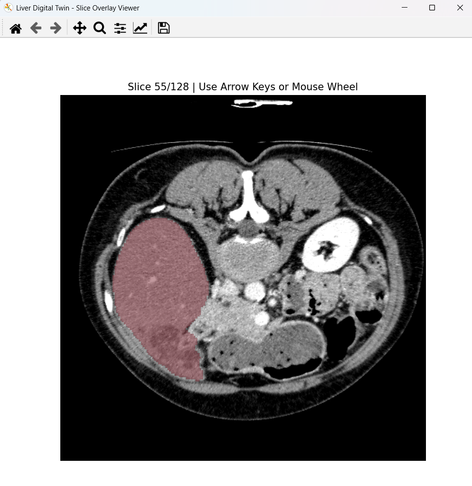

<h1>LIVER DIGITAL TWIN: Functional Liver Planning</h1>
<blockquote>
    
<strong>A Computational Medical Imaging &amp; Virtual Hepatectomy Framework for Quantitative Functional Assessment of the Liver</strong>

    
<em>Undergraduate Graduation  Project — Medical Biophysics</em>

</blockquote>

<h2> Summary &amp; Overview</h2>

Surgical planning for liver resection (hepatectomy)  relies heavily on anatomical volume calculations. While measuring the prospective remnant liver volume  provides basic safety thresholds, anatomical volume does not always correlate linearly with functional hepatic reserve, especially in patients with underlying parenchymal diseases (e.g., steatosis, cirrhosis, or post-chemotherapy tissue changes).

<strong>LIVER DIGITAL TWIN</strong> is an open-source computational biophysics pipeline designed to bridge the gap between anatomical structure and tissue quality. By integrating 3D Computed Tomography (CT) volume reconstruction, automated deep-learning segmentation, quantitative Hounsfield Unit (HU) radiomics, and simulated surgical resection, this framework constructs a patient-specific "Digital Twin" to estimate and visualize both the <strong>quantity</strong> and <strong>quality</strong> of functional liver tissue post-resection.

<blockquote>
    
<strong>Disclaimer:</strong> <em>This software is an educational and scientific research prototype developed as an undergraduate graduation thesis. It is not approved for clinical diagnostic or therapeutic use.</em>

</blockquote>

<h2>Medical &amp; Scientific Motivation</h2>

When a surgeon evaluates a patient for major liver resection, two critical questions must be answered:

<ol>
    <li><strong>How much liver volume will remain after surgery?</strong></li>
    <li><strong>Is the remaining tissue healthy enough to sustain metabolic function?</strong></li>
</ol>

Standard surgical workflows rely on manual or semi-automated contouring to estimate remnant volume. However, tissue heterogeneity, fatty infiltration, and regional vascular perfusion differences remain unquantified.

This project implements a <strong>Digital Twin methodology</strong> in a medical imaging context:

<ul>
    <li><strong>Anatomical Modeling:</strong> Reconstructing physical 3D patient geometry directly from DICOM coordinate spaces.</li>
    <li><strong>Tissue Characterization:</strong> Quantifying parenchymal health through Hounsfield Unit (HU) mapping and radiomic texture features.</li>
    <li><strong>Virtual Intervention:</strong> Simulating virtual resections to evaluate post-surgical outcomes in a risk-free computational environment.</li>
</ul>

<h2>Results and Visualization</h2>

<h3>Liver Segmentation</h3>

The current pipeline implements an interactive 2D Axial Slice Overlay Viewer built on an optimized Matplotlib desktop window layout manager. The framework reads multi-dimensional NumPy arrays and applies a mathematical transparency layer to overlay the semi-transparent red AI tissue mask cleanly over the grayscale anatomical CT scan slices. It automatically tracks real-time array boundaries, enabling cross-sectional visual inspection via the mouse scroll wheel or keyboard arrow keys without masking underlying dense skeletal structures.

    

<h2>Project Directory Tree</h2>

As managed inside the repository environment, processing operations are fully decoupled from local visualization tools to prevent system dependency pollution:

<pre>
Liver-Digital-Twin/
├── main.py                         
├── debug_check.py                   
├── README.md                       
├── patient_3Dircadb1.2.nii.gz       # Unique patient-specific continuous 3D anatomical volume data
├── results/                         # Target storage boundary for calculated binary segment masks
│   └── liver_3Dircadb1.2.nii.gz     # deep learning 3D liver segmentation mask
├── docs/
│   └── images/                      # Workspace UI figures and visual pipeline verification captures
│       ├── Pateint1_seg_overlay.png
│       └── digital_twin_viewer (2).png
└── src/
    ├── medical_volume.py            
    ├── Image_Loader.py              
    ├── image_io.py                  
    └── segmentation.py              
</pre>

### TODOS
----------------
- [ ] add more documentation to the code
- [ ] in readme , for someone wanna reproduce this experiment and results 
    - [ ] write exactly what he will do
    - [ ] add requirements file (libs that should be installed to get this project working)
- [ ] use conda for environment management (read about this)
- [ ] add .gitignore (read about it)

- [ ] make the workflow as follows :
    - user open the main window ---> he will find a button to load nii file ---->when click it will open file selection window----> select the file ---> the file open and the user can see the volume
    - user can maniplate ww and ww , and can go through slice with a slider 
- [ ] add a button that call liver segmentation ( so that when click ) the total segmentator will run ---->output the liver mask -----> the mask overlayed over liver tissue ------> we cab see liver with generatedd mask
- [ ] afte we get this app that enable user to load his files and run segmentation ...we will stop and re-organize the project and add decide what to add more